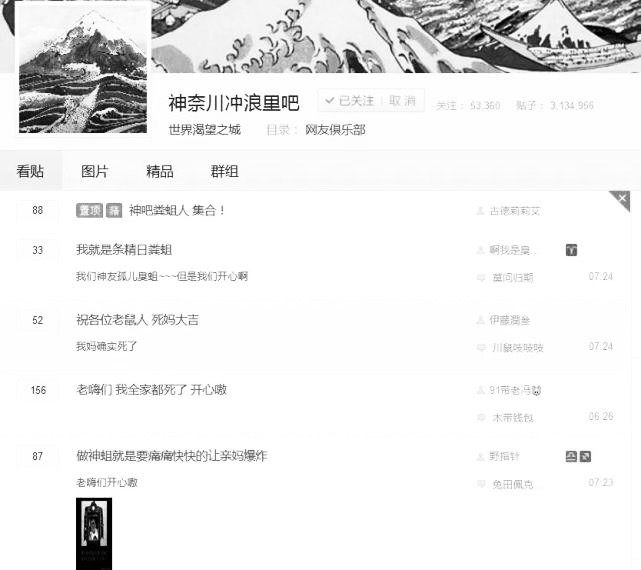

# 神奈川编年史

（发表于 2021 年 10 月，原作者军师钟士季，一次转载者冰##夜）

## 序——It's my duty

很荣幸能够受到作者军师钟士季的邀请来为本书写序。我作为一名荣誉神友、经历了以抽象 tv、修车 tv、带秀 tv、冲浪 tv 为主线的红中嗨、久经考验的浪人、甜品级嗨粉，对军师钟士季的工作自然是十分支持的，不如说，我的看法是：早该写写了。

在 2020 年 2 月那一次万众瞩目的神对兔闪击战中，神吧在兔友的口口传唱中，终于“火了”，被迫打开封闭的大门，让“神友”一词逐渐走出了贴吧。至今不过一年的时间，网络环境已经发生了极大的变化，而“神友”二字已经如雷贯耳，无人不识，无人不晓。然提及神友的来源、给神友这一概念下定义，网络上却是众说纷纭、莫衷一是。正如抗压吧吧友不会去思考他们的梗是从何而来一样，在互联网 2.0 时代，大部分人在面对一些问题时，明明拥有着搜索引擎这一强大的信息检索工具（必须要说明的是，在李姓企业家的垄断下这一工具反而常常会造成误导，实乃悲哀），却鲜有求证、深入调查的思想，往往流于表面。即使有人深入一步，也仅仅停留在李姓企业家给出的搜索答案或是他人的口述，便以为了解了全貌，将此事放下，去寻求他物了。这也是信息爆炸时代的人们的特征之一——在习得科学的分析信息和数据的能力前，就已经接触了大量的信息，被信息所信息化，沦为信息的奴隶而非主人。

关于神吧、神友，由于神奈川冲浪里吧已经被封锁一年有余，加之真正的神友不喜欢表露自己的观点，与神吧有不解之缘的兔友则趁机垄断了神友一词的解释权。而兔友则大多是前所述的被信息化奴役之人，他们自身也难以给出神友一个准确的、无二义的定义，只是一味地根据自己的固有印象来辱骂神友，通过兔友的反向塑造，神友的形象逐渐被固化为兔友的反对面，也正是在这一过程中，神友的概念被不断扩大，也被不断的传播。于是到了今天，我们可以看到一种怪象，很多人称自己为神友，却不知来源；很多人骂神友，却也不知神友到底为何物。在此基础上，很多人又根据自己对“神友”一词的理解划分出了各式各样的神友，这下人人有神当，一千个人眼中有一千个神友，神友这一模糊且语意不明的概念得以大规模席卷局域网。

很喜欢一句话：要了解一个事物，首先了解它的历史。军师钟士季在本书中以一位旁观者视角客观、系统的描述了整个神吧的历史，将神秘莫测的神奈川冲浪里吧的真实面貌揭开给读者，这是第一次读者能够以真正的“神友”身份和视角去观看神吧与神友们，而不是传统的兔友视角，相信读完本书后，读者会对“神友”这一神秘群体有着全新的理解和感悟。

冰##夜

2021 年 10 月 7 日

## 关于本书

本书是一本完全免费的、开源的电子书籍，是一本编年体断代史，记载从 2019 年 5 月古德莉莉安当选神奈川冲浪里吧吧主至 2020 年 3 月神奈川冲浪里吧被永久封禁期间的历史。本书第四部分为笔者的一些杂谈，读者可以有选择的进行阅读。本书内容完全源自笔者自身亲自回忆、亲自整理，因此，可能存在有许多细节上的错误与讹漏，还请读者谅解。读者可在 issue 中随时提出修改意见，笔者会及时查看并重新审视书中的内容，谢谢各位！

## 目录

0. 归去来兮——神奈川从何而来

> “你知道神奈川冲浪里怎么读吗？”

### 第一部分 成神之日——“像创客一样创业”

1. 魔星下凡——最初的晚餐

> “群贤毕至，少长咸集。”“朝晖夕阴，气象万千。”

2. 三板斧——古德莉莉安谈治吧理政

> “我将无我，不负吧友”

3. 村霸与光棍文豪——魔幻现实仰山村

> “What is rational is actual, and what is actual is rational.”

4. 万人敌——温泉关 800w 勇士东征神奈川

> “三界不安，犹如火宅”

5.  四大天王——神奈川政治得失

> “我的戰鬥力是 53 萬”

6. 浪里鼠人——神吧第一次被封

> “世事一场大梦，人生几度秋凉”

7. 凯风快晴——二龙山好汉聚首

> “Freedom is always and exclusively freedom for the one who thinks differently.”

8. 国庆献礼——已然遥远的圣城

> “不要慌，是技术性调整！”

### 第二部分 只有神知道的世界——“像创客一样思考”

9. 同床异梦——重生的神奈川

> “他不在这里，已经照他所说的复活了。你们来看安放他的地方吧。”

10. 九龙治水——暴风城中安如山的茅屋

> “🔄”

11. 卧薪尝胆——普通 tv 的覆灭与辉的离去

> “败陈毅、斗李赣，上演了抽象的芈月传”

12. 他将如闪电般归来——胖哥与夺子姐

> “豆一搭，手一抓”

13. 异军突起——伏拉夫

> “民族主义促使国家产生，而不是国家产生了民族主义”

14. 神化大革命——兵古内战

> “神吧是一个两万人的大贴吧”

15. 三进宫——再陨落

> “What does not kill me, makes me stronger.”

### 第三部分 神不在的星期天——“像创客一样离开”

16. 粉墨登场——觉醒带粉与笑川 tv

> “👴🐘😀”

17. 暗流涌动——“华南海鲜市场”

> “转转转转转转转”——张顺飞

18. 黑天鹅——大爆发与大引流

> “That I exist is a perpetual surprise which is life.”

19. 冠世一战——古德莉莉安闪击兔吧

> “我的战争是别人刻意安排的，我的人生却是自己选择的”

20. 将星陨落——古德莉莉安命逝五丈原

> “人或有一死，或轻于鸿毛，或重于泰山”

21. 诸神的黄昏——神奈川冲浪里吧倒闭

> “哦，真的牛批，你真的你还有这种电话的”

### 第四部分 神的随波逐流——后神吧时代杂谈

22. 沐猴而冠——深川万年桥下吧

> “神说，要有光”

23. 时无英雄，使竖子成名——v 吧与神吧

> “诶，不是中国的奶茶而是台湾的奶茶吗？”

24. 冠世二战——巴巴罗萨计划

> “war,war never changes”

25. 6326——抽象的夏天

> “推！”

26. 神吧三大将

> “to be or not to be, that's a question”

27. 蓬莱山辉夜

> “小伙纸你摇了我吧”

28. 古拉格群岛

> “不必时时怀念我，也不要指望我会回来，我走之后，你们就是我”

29. 骆华忠瘸子遇难

> “人是万物的尺度”

30. 人生自古谁无死——神吧的终焉

> “还好，一切如愿以偿”

## 0. 归去来兮——神奈川从何而来

> “你知道神奈川冲浪里怎么读吗？”

2019 年 3 月 21 日，发生了贴吧抽象历史上一次大转折，修车 tv、带秀 tv、冲浪 tv，一夜之间全部倒闭，次日晨，无数太君、嗨粉、浪人打开手机百度贴吧，顿时陷入了迷茫，两个简短而有力量的问题在所有人脑中回旋：① 我家呢？② 新家在哪？

关于各种 tv 的来源。抽象 tv 在 17 年底被封禁后，一众人搬家到了修车 tv，但修车 tv 吧由于吧名问题经常被百度引流，大量网恋太君涌入，加上吧主不作为，还被爆卖吧丑闻，大量失望的嗨粉出走，成立带秀 tv。但有人的地方就会有斗争，2018 年发生了一件我不好说我擦的事件，导致吧内某种类型的帖子比例开始飙升，而带秀 tv 吧吧主梦之主为了维护自己的统治地位，也为了防止带秀 tv 吧被封禁，于是大量封禁一些喜欢发某种类型帖子的人，不满开始积攒。终于 2018 年底冲突爆发，大量不愿遵从梦之主管理的吧友出走到了百度贴吧冲浪 tv 吧，自称“浪人”，与带秀 tv 切割。至此，太君在修车，生活在带秀，冲浪在冲浪的三足鼎立局面形成。

事与愿违，美好时光总是短暂的。2019 年 3 月，可能是由于冲浪 tv 吧的高强度冲浪，百度官方直接把三个吧一起封禁，贴吧嗨粉重归流浪时代，自嘲为网络吉普赛人。

由于 2018 年同时爆发了蔡徐坤激光笔、碧诗大战狗粉丝等事件（详见军师姜伯约抽象编年史与缝合编年史），后来又出现一个抽象带篮子偷梗，大量带粉污染环境。让本就拥有厌恶新司机基因的贴吧嗨粉更加加大了对引流狗的恶意，因此，无数流浪的鼠人都在寻找没有引流狗的伊甸园。

原百度冲浪 tv 吧的部分吧友厌倦了漫长的贴吧流浪和无穷无尽的审核，连上了互联网，跑去了红迪开了一个新频道，号称永不陷落的堡垒，即 r/chonglangtv

与此同时，贴吧嗨粉经历了带秀之家、战狼之家、战狼 tv、下水道 tv、扎心 tv 等一众新家的艰难探索后，2019 年 5 月 15 日，以上新家再次惨遭收网。所有人被引流到了带明星吧（在此期间，带秀之家吧吧主存在极大争议，id 名为“古德莉莉安”的吧友对其表示不满）

带明星吧吧主很快就漏出了其獠牙，卖孩丑闻遭到曝光，顿时人走鸟散，笔者当时也离开了带明星吧，但一直没有找到稳定的新家，直到 2019 年 6 月初，发现有人在贴吧@我，此人正是神奈川冲浪里吧吧主古德莉莉安。

## 第一部分 成神之日——像创客一样创业

## 1. 魔星下凡——最初的晚餐

> “群贤毕至，少长咸集。”“朝晖夕阴，气象万千。”

2019 年 6 月，古德莉莉安凭借超级会员签到优势 0 票当选神奈川冲浪里吧吧主。古德莉莉安深谙“信息时代，最重要的是人才”的理念，在获得吧主席位后，计划将当时在百度贴吧流浪的幽默风趣的吧友引流到自己的贴吧里来。

古德莉莉安利用了吧友银翼游骑兵等人以前用大召唤术圈人时的清单，圈了几百楼，把优质人才渐渐都引流进了神奈川冲浪里吧。

由于招收了大量优质吧友，神奈川冲浪里吧早期的氛围十分融洽，虽然人数不多，但节目效果却丝毫不减，整个贴吧呈现出欣欣向荣的趋势。

但随后知名吧友带明星“好心的预言家”对时任吧主古德莉莉安提出了质疑，认为其 0 票当选不符合程序，顿时一片哗然。

要知道，当时贴吧嗨粉遭到带明星吧吧主和抽象带篮子等人的接连背叛，对当权者抱有极大的警戒心理，古德莉莉安顿时遭到了巨大的压力和质疑。

不得不说，古德莉莉安是一位十分精明的政客。当时政权不稳的古德莉莉安迅速做了三件大事，打消了吧友们的疑虑，吧友们开始大呼“古德古德”。

## 2. 三板斧——古德莉莉安谈治吧理政

> “我将无我，不负吧友”

古德莉莉安走马上任后，为了获取吧友的支持，立马做了三件大事。

其一，使用陶片放逐法放逐知名炒作狗“丑八怪 517”。丑八怪 517 其人因为长期发表诸如“烟城雾”“优衣库二选一”之类的无意义帖子，一直被广大吧友广为诟病，当时抽象带篮子陈义炒作成功，丑八怪也开始有样学样搞贴吧直播，更是引得众人厌恶。神奈川冲浪里吧成立后，丑八怪不请自来又开始发表大量睿智贴，已然一定程度上激起民怨，这时古德莉莉安使用了雅典陶片放逐法来对丑八怪 517 发起公投。古徳莉莉安擅于嗾民之所向，他知道，只要他发起公投，那么丑八怪肯定会被公投出去，一来除掉一个牛皮糖，缓和吧内情绪，二来这种开创式的民主实践也能塑造自己开明的形象。要知道，此前的各种 xxtv 一直是吧主的一言堂，吧主和吧友内斗已然变成传统节目效果，古德莉莉安要脱离“吧主=司马”这一传统刻板印象，就必须塑造全新的人设。陶片放逐一出获得了吧友的一致支持，可见这一创造性实践是极其成功的。

其二，利用公权力打击引流狗。古德莉莉安从五千年灿烂文明中汲取精华，创造性的总结出了“吧友民主专政”的概念，对吧友的敌人实行冷酷无情的专政手段，这个敌人，首当其冲的就是引流狗。对引流狗的痛恨是根植于贴吧嗨粉的内心的，在孙笑川，带篮子等贵物炒作成功后更甚。早期的神吧吧务只有古德莉莉安一个大吧主，一有人发现了引流狗立马@古德莉莉安，古德马上赶到将引流狗 🔄，这一举措立马引得吧友们“古德古德”的赞誉。带秀 tv 后期很多人跑去了冲浪 tv，正是由于吧主梦之主疏于管理，引进了大量引流狗，古德这一举措，得到了以带秀 tv 吧吧友为代表的嗨粉和以冲浪 tv 吧吧友为代表的浪人的一致好评。

其三，打造亲民人设。本来嗨粉就具有十足的反权威和叛逆精神，在百度贴吧制度下，吧主几乎等同于贴吧的拥有者，可以随意使用独裁手段管理贴吧，这一设定本就让吧友十分反感，再加之在 2018 年发生一起我不好说我擦的事件，反吧主思潮大行其道。“谁当吧主谁司马”的说法逐渐成了主流，而吧主的贵物率高居不下，更是反向引领了这一说法流行，这也是为什么到后期没人喜欢当吧主。亲民人设带秀 tv 吧吧主梦之主就尝试打造过，可惜后期与冲浪 tv 意见分歧导致人设崩塌，二十四个梦之主、赛亚人等称呼无不说明其形象的崩坏。古德莉莉安吸取了前人经验，用了一些特殊的方法暂时维持住了亲民人设，确保了权力的平稳过渡，可见其治吧水平。

古德莉莉安依靠这三板斧稳固了自己的政权，但当时有人开始怀古叹今，认为神吧节目效果大不如前，可人就不知道，自己啊就不可以预料，节目效果即将自己走到门前。

## 3. 村霸与光棍文豪——魔幻现实仰山村

> “What is rational is actual, and what is actual is rational.”

前文提到，在 2019 年 3 月三家归宏到 2019 年 6 月神吧创立，期间有约三个月的流浪时间。当时遭到了李彦宏的定点打击，被封掉了无数的吧，最后一些吧友索性开始鸠占鹊巢，去 cctv5、cctv15 等企业级 xxtv 吧开始发帖，在那时，有一 id 名为“仰山杨爱民”，头像为红底证件照的贴吧吧友火速引起了吧友的注意。

这位来自江西瑞金仰山村的 47 岁中年人可谓积极响应国家号召实名上网的标范，不仅把自己真名当做贴吧 id，头像用的是自己 28 岁时拍的证件照，而且发帖毫无保留，和别人对骂自爆身份证和住址求来信砍，光明磊落至此实在是令笔者汗颜。相较之下，笔者就像一条下水道的老鼠，用着假手机号、隐藏各种信息、用各种乱七八糟的手段隔离真实身份和网络空间，显得一切都很假。

杨爱民先生出生于江西农村仰山村，家庭贫困，为家中次子。19 岁初中毕业之后就开始外出打工，到了广东，一打工就是三十年，打工至今近 50 岁，仍旧未娶，依然过着春天回家过年其他时间去广东打工的两点一线生活。而网络空间上的他则大为不同。他自认网络文学家，自称从 2002 年开始就在网吧上网发文章，喜欢汪国真，不喜欢莫言，喜欢一贴多发，关注了杂七杂八的贴吧，自己一有大作完成，立马发到各类贴吧请求网友点评。在现实中，他是一个五十岁没房没车未婚无子低学历龙鸣，社会意识中纯纯的失败者，但在网络上，他的头像上永远带着 28 岁自信乐观的笑容，做着自己喜欢的事情（可惜被很多人骂做魔怔 b，但好在他可以反击）。

（“仰山杨爱民”这一贴吧号依旧活跃，可以去观察一下真正的 incel 是什么样的，对二十多岁的性焦虑玉玉症患者属于降维打击）

那时，仰山杨爱民的大作出炉，狂暴轰入各类贴吧，一瞬进入在 cctv5 吧刷帖的浪人的视线。文章行文狗屁不通，又臭又长，逻辑混乱，顿时引起了一通谩骂。

必须要提的是，杨爱民的文章关注度其实很小，虽然网络发文十余年，但除了瑞金吧、卓依婷吧等经常没有人理他。而贴吧狗粉丝继承了直播间狗粉丝的基因，最喜欢干的事就是捣蛋和分布式网络攻击，嗯造节目效果。杨爱民果断对无礼的狗粉丝做出了回应，见一个回一个，高互动率赢得了吧友的一致好评。可惜的是，短短几天网络吉普赛人这种鸠占鹊巢的无耻行径立马被正义的贴吧 madam 发现，立马进行了血腥清场，嗨粉们被迫撤离 cctv 系列贴吧。

笔者本以为杨爱民已是过客，谁曾想神吧成立后不久，杨爱民成名大作“生母和养母哪个大”立马在神吧首页屠版！原来杨爱民一直跟着吧友们搬家，吧友们大受感动，于是高强度破口大骂，杨爱民也高强度回复反击。杨爱民经典的自动化回复、实名上网、狗屁不通的文章立马被吧友大呼有节目效果，一瞬成为早期神吧炙手可热的带明星。

不久，杨爱民又发一篇经典大作“最后更新的检举信”，文章举报村委主任杨晓春是“村霸”，行文洋洋洒洒列出杨晓春二十六条罪证，指责其破坏自己家自盖的茅房、堵自家的路，可谓旷古巨作，字字是血。此文一出，立马又被吧友大呼节目效果爆炸。俗话说现实总比网络更魔幻，被李彦宏四处追赶的吧友看到魔幻至极的仰山村和杨爱民也只能甘拜下风。

杨爱民的出现，顿时在贴吧兴起了一阵“杨爱民学”，让新生的神吧焕发出了活力。

然而，凡事皆有两面性，杨爱民与接下来发生的一件事一起无意间奠定了神吧的基因，从那时起，神吧覆灭的结局也就注定了。

附：[杨爱民家族](https://imgur.com/a/XVVBYkV)

## 4. 万人敌——温泉关 800w 勇士东征神奈川

> “三界不安，犹如火宅”

前文提到，仰山杨爱民的到来为初生的神吧带来了不少节目效果，这里不得不补充一些细节，以便让读者更好的了解神吧早期的生态，以及笔者接下来的论述。在杨爱民出现之前，其实还有一个“荷兰四神”存在。众所周知，地域黑节目是泛抽象贴吧的固有环节，神吧刚开始没什么有意思的贴，于是就开始经典节目的回归，“荷兰四神”也是在那个时候被引流进神吧的。为什么叫荷兰四神？因为这是四个人，但他们之间并没有朋友或亲属关系，只是同时在一个局域网空间冲浪，以及拥有同一个身份——荷兰人。本来地域黑环节在那个时候已经有点烂活的意思了，因为已经激不起人们的回帖欲望了，而且都是一批人一起玩了这么久，也不会因为这个被破防。但多亏了李彦宏的指导，有一天地图炮荷兰人的帖子上了贴吧首页，立马引起大量页友荷兰人的反击，而荷兰四神则是其中最执着的四人。大多数页友只是在一个帖子里骂骂就走了，而这四人一直追着在神吧的每一个帖子下面回骂，而狗粉丝为了调戏他们每次有荷兰相关的要素就艾特他们，他们就随叫随到，于是开始互喷。

这个小插曲看似和本小节的内容不相干，但无论是所谓的荷兰四神还是杨爱民，他们有一个共同特点——都是贴吧首页引流来的。这就与我们后面要说的事有联系了。

某天，知名吧友雷震子发表了一个帖子“理性讨论——玩 DNF 的人是不是都是傻逼”。本来这个帖子并没有引起多大反响，因为这帖子实在太直球了，就一个标题什么都没有，经典的地图炮，还有当时就已经成为烂梗的“理性讨论”放在标题里，根本让人没有回帖欲望。

但世事难料，第二天，突然这个帖子就多了几百回复，笔者好奇之下点进去一看，发现全是 1 级绿牌页友在辱骂楼主。一查才发现，原来是李彦宏把这个贴推荐上了贴吧首页，DNF 吧八百万勇士看到这个贴立马义愤填膺，纷纷表示不能忍。当时，勇士们刚刚过了西装节不过多时，士气正旺，没曾想竟还有人敢侮辱我大勇士，被指“死肥宅”的屈辱感和愤怒感立马涌入脑里，800w 勇士蓄势待发，誓要让螳臂当车不自量力只有 8000 人的小小神吧付出血一般的代价。

勇士一怒，血溅五步！无数勇士自发东征神吧，大战一触即发！然狗粉丝也不是吃素的，当年只有小小一批人照样在斗鱼横行霸道，金达莱花开遍直播间，光凭数量又怎能让他们屈服？于是神吧第一通天高楼连夜拔地而起，短短时间就盖了 1w 层，让神吧吧友叹为观止。

然而，勇士们这次却打了一场夷陵之战，大败而归。究其原因，还是战斗思维逻辑所致。神吧是扁平松散化的组织结构，勇士们不能像以往那样具体到个人进行对点的网暴，愤怒的他们只能像愤怒的小鸟一样疯狂的愤怒，胸中一口恶气永远发不出去，不少人最后只好使出最无耻的一招——贴吧会员禁言。

勇士们自觉这样不是办法，于是他们找到了神吧唯一的吧务——吧主古德莉莉安，指责其治吧无方，手底下一群没教养的东西。而古德莉莉安一句“不清楚，我主玩花花”，立马把没见过世面的勇士们弄得找不着北了，这下也不知道该怎么打了，一批一批勇士愤怒的前来，又一批一批懵逼的离去。更有甚者有些发现神吧的帖子还挺有意思，赖着不走了，当场融入。

这下反倒该轮到神吧吧友慌了，他们最痛恨的就是引流狗，隔壁有个孙笑川吧一直视奸已经够烦了，又来一批赶都赶不走的自来熟牛皮糖，实在是不得了，于是吧里风向开始转变，很多人开始指责古德莉莉安纵容引流狗，走带秀 tv 吧吧主梦之主后期的老路。就这样又混乱了好几天，最后那个万层高楼因为污言秽语过多被李彦宏删掉了，神吧也首次开启了四级墙，暂时将页友格挡在了墙外。DNF 吧勇士 VS 神奈川浪人的战斗告一段落，但这件事对神吧的影响却是极其深远的。

从荷兰四神、杨爱民，到 DNF 勇士，神吧无意识发现了一条节目效果生产线——引流页友。缤纷多怪的页友和神吧的抽象价值观一碰撞立马爆发出了绚烂的花火。引流页友无意间成为了神奈川冲浪里吧的基因，成为了神吧人的群体无意识，关于这一点，我们以后还会看到。

引流页友这一行为不仅仅是双刃剑，而是地球毁灭装置，它从一开始就是不可靠的，充满了随机性和不可控性。虽然很多人潜意识中觉得这样做能带来节目效果，但万不会有人敢公开这么说，因为一个不慎就有可能万劫不复（而事实告诉我们，“神吧”今天已经不存在了，证明这并非危言耸听）。犯下“引流罪”的雷震子和古德莉莉安一时间在吧内遭受到了巨大的政治压力。古德莉莉安零票当选的出身再一次被拿出来议论，泰山压顶的古德莉莉安终于不堪其负，做出了一个重要决定，神吧政治风云正式从黑暗中被抬到了明面上。

## 5. 四大天王——神奈川政治得失

> “我的戰鬥力是 53 萬”

前文提到，DNF 事件后，古德莉莉安的政治地位出现了晃动，神吧曝光率增加，其一人批奏折的独裁统治难以为继，重重压力下，古德莉莉安决定开放了吧禁。古德莉莉安发帖公开招募小吧主，吧友自主报名，可以毛遂自荐，也可以推荐他人。当时 DNF 事件导致吧内引流狗的引进加速度增长过快，吧友们早就对此产生不满，这下权力开放，吧友们纷纷表示：引流狗的末日到了。

但选举过程却并不十分顺利。前文也提到过，抽象贴吧的吧务并不能因为李彦宏给予了生杀大权就当土皇帝，因为人才会外流，没有幽默的吧友要么没人说话慢慢等死，要么只能沦为孙笑川吧一类的二流垃圾贴吧。其次，吧务因为有公权力，一出事往往第一个司马，而且也不能靠广告盈利，这是抽象贴吧的禁忌，尤其是神吧是在带明星吧吧主十三姨覆灭后刚出现不久的贴吧；因此，吧务就成了纯纯的公益项目。吧务不仅要快多好地免费干事，还要抗压挨骂，而且一个米都收不了，干得不好还可能背负永久骂名，唯一正收益大概就是干的好的话可能在吧友中拥有一丝名誉。再次，则是古德莉莉安本人政治成分一直被怀疑，成为其手下直接隶属的小吧有被当成狗的风险。

综上，其实没多少人愿意担任吧务。不过，总有一些人愿意自发的维护良好的社群氛围——人人为我，我为人人。在推荐和民主选举决议的双轨制下，古德莉莉安最终从吧友中选出四人担任小吧主，即后来神吧的四大天王——此四人分别是：带带游骑兵、雪之下雪乃、大屁股侠、电竞阿姆。

- 带带游骑兵，红老嗨，带秀 tv 吧时期十分活跃的吧友，北京理工大学研究生在读，神吧历史中的重要人物，后面我们还会再提。

- 雪之下雪乃，红老嗨，因为 id 经常被和知名吧友泥头车司机“狂草雪之下雪乃”拿来联动，在后续章节也大放异彩，读者可以尽情期待。

- 大屁股侠，大概 17 年引流而来，智障吧吧主，网络冲浪达人，纵横于多个网络亚文化领域。

- 电竞阿姆，知名吧友，因为头像是潘玮柏加上经常有意间透露自己可能患有 ED，一般被称为“萎勃”。

笔者认为，一般像很多人齐名的一个团体，一定有至少一人以上是凑数的，神吧四大天王里自然也不例外。古德莉莉安很晚才发现了这个问题，导致后期不得不又搞出一个“九龙治水”，可惜已是亡羊补牢。

古德莉莉安的分封制将风狂雨骤的神吧暂时平定了下来，四天王上任后大量引流狗惨遭火烤。如果古德莉莉安管理的是 B 吧，宫吧这种放个猪上去都能管好的贴吧，那古德早就在吧友间成了圣人。可惜，神奈川冲浪里吧具有独特的历史，神吧吧友也与其他吧的人有着本质区别，这就注定了其要走一条要与古今中外所有贴吧论坛所不同的、具有神吧独立自主特色的治理道路，古德莉莉安本意是好的，分封制也确实起到了一定的作用，然而他的政治措施却是孤立的、静止的，他仅从神吧内部去机械的分析问题，没能正确认识到 2019 年的三家归宏问题的严重性，而几个月后出现的更大的黑天鹅，更是难以预料。面对充满不确定性的未来，重要的不是预测，而是及时地做出改变。神吧政治问题最终催化了神吧的分裂与混乱，当然，这是后话了。

## 6. 浪里鼠人——神吧第一次被封

> “世事一场大梦，人生几度秋凉”

2019 年 8 月 16 日，神友们一如既往地网上冲浪，然而，到了中午，大的来了。“此吧仅限吧务团队发帖”，熟悉的魔咒重新显现于每一位神友的心中，顿时间——高兴的、悲伤的、愤怒的、胆怯的，无数的情感喷薄而出，打在了度娘建造的冰冷的叹息之墙上，好像度娘此刻像小学生一样笑嘻嘻的说“反弹”，各种各样的情感又被打回了每个人的体内。

神吧倒闭了，历时不过两个月，成为了无数过去的家的一个。网络老鼠们又一次失去了他们的家园，回归了抱头乱窜的流浪生活。两个月的时间虽然短暂，但依旧为大家贡献了不少节目效果，造了几个好梗，在频繁搬家的日子里，两个月的时间其实已经不是很短了。

古徳莉莉安在这期间创造了“神友”这一名词，妄图把带秀 tv 和冲浪 tv 的所有人都归类到这一个指代词下，野心之大让人怀疑他不知道要干什么。

既然家都倒闭了，也就没有再尊敬古徳这个名义领军的必要了，神友暂时的陨落，该回来的，都该回来了。神吧的倒闭正是象征着古徳的绥靖政策的破产，我感觉到了，下一站，富岳第二景！

## 7. 凯风快晴——二龙山好汉聚首

> “Freedom is always and exclusively freedom for the one who thinks differently.”

前文提到，神奈川冲浪里吧正式倒闭。总有些先知未雨绸缪，一位东方痴吧友受到新作东方凭依华中藤原妹红的一张符卡的指引，在神吧倒闭前夕已经指明了下一站——凯风快晴。

2019 年 8 月 17 日，流浪之人来到应许之地，二龙山好汉正式落草，短暂而辉煌的三日天下正式拉开了序幕。

与很多兔友想当然的臆想不同，古徳莉莉安以及其麾下的四大天王一直都在大力删除政治相关的帖子。神奈川冲浪里吧使用了和冲浪 tv 相同的葛饰北斋名画当做吧头像，古徳莉莉安打着重建抽象 tv 辉煌的幌子吸引了大量浪人，却使出无耻的一招——禁言，这让天性自由的浪人们如何忍得住？被古徳莉莉安删帖，这也能忍？能忍就不是浪人！

古徳莉莉安的举动激怒了浪人，他们在神吧尚存时就疯狂输出自曝，最后古徳不得不使出比无耻的一招更无耻的一招——封号，彻底让群体愤怒了，如今神吧倒闭，浪人们自然是恨不得开香槟。神友已死，浪人当立！

凯风快晴没有吧主，完美的实践，浪人们再次屹立于浪潮之巅！说实话，笔者认为凯风快晴吧的节目效果简直直逼早期的冲浪 tv，成立第一夜晚上的帖子的幽默度兼备，值得现在的引流狗学好几年。

当然，后果是第二天又复刻了冲浪 tv 的北京人之夜，度娘马上杀的头上冒火了，神吧长久的压抑得到了井喷式爆发，这种节目效果只能说可遇不可求。

在度过两天狂欢夜后，凯风快晴吧也终于稳定了下来，大量生活贴也开始跟进，无家可归的带秀 tv 吧友也零零散散的加入，一时间凯风快晴如日中天，不少人直言神吧就是坨翔，就算复活也不回去（当时古徳莉莉安放风说神吧即将恢复）。

然而知行不合一是狗粉丝的本质特征，2019 年 8 月 23 日，神奈川冲浪里吧涅槃重生，神友们回来了！一时间无数人重新返回神吧，包括那些觉得凯风快晴吧的人太狂的，一时间凯风快晴吧发帖量大幅下降，又让墙头草们迷失了方向。

当时所有人都觉得神吧走了带秀 tv 的老路，以后就像带秀冲浪分治那样让喜欢发生活贴的回神吧，让浪人继续在没吧主的凯风快晴吧。理想是丰满的，现实是骨感的。神吧复活后不久，百度凯风快晴吧迎来了一位重量级嘉宾——贴吧小管家，其宣布凯风快晴吧吧主开选。

顿时度娘的本命星座飞马座立刻发出了耀眼的光芒，凯风快晴吧吧友表示，谁选谁和度娘一起死妈。由于凯风快晴吧成立时间短，没有吧友到达能投票的 6 级，某不知名吧友成功零票当选凯风快晴吧吧主——被吧友怒斥复刻古徳，凯吧的败类！

所谓福无双至祸不单行，刚当选的新吧主还没来得及做出上任承诺，凯风快晴吧就正式宣布倒闭(可能有有人不喜欢吧主而公开放送的原因)。

凯风快晴吧倒闭之后，大部分人都回流到了神吧，没别的原因，只是因为那边稳定，可以有个说话的地方，所有人都认为凯风快晴那种模式不能长久。然而也有执着的浪人，流浪已经成为了他们的生活方式，真正的浪人没有家园，每一天都是漂泊，他们像推石头的西西弗斯，一次次的梦想着建立自己的乌托邦，一次次的被度娘一脚踢塌，又一次次的流浪、找家、建设。

笔者对于凯风快晴吧这样短暂而辉煌的时期是抱有一定的好感的，它就像流星一样闪耀而易逝。

神吧倒闭和凯风快晴两个事件导致了古徳莉莉安指导下的神吧与浪人团体的彻底割裂，从此神友是神友，浪人是浪人，互不两立。要多提一点的是，凯风快晴的短暂辉煌让古徳麾下的一位四天王立场发生了动摇，种子已经种下，在下一次危机来临时，它将引领神吧再次发生巨变。

## 8. 国庆献礼——已然遥远的圣城

> “不要慌，是技术性调整！”

时间很快来到了九月开学季，前文业已提到，凯风快晴吧生命虽然短暂，但真正让冲浪 tv 吧引流来的浪人们过足了一把冲浪瘾。而此时凯风快晴吧爆炸，取而代之的是古徳莉莉安治下的神奈川冲浪里吧复活，此时古徳莉莉安再也无法无视吧内的两股逐渐对立的势力了，不能再像神吧早期到处引流那样打哈哈，割席之时已到。

神吧一经复活，古徳莉莉安立马下了死命令：坚决整改，加大打击力度。可以看出古徳莉莉安想要复刻带秀 tv 的老路，让热衷于谈论政治的那批人另寻一个场所，让神吧彻底回归以生活讨论为主的主题。然而今时不比往日，以前在抽象 tv 的老人逐渐回归生活淡出了网络，到了带秀 tv 不仅是外部大环境翻天覆地，人员结构也已经悄然变化，当年抽象 tv 人均司马的学生狗步入社会后接受了无数不可见的拷打，加之度娘的无底线，心态早已不比当年。

彼时的抽象 tv 吧很多人说满页生活贴，但笔者认为纯属引流狗瞎怀念，那时百度贴吧尺度还很大，抽象 tv 吧最喜欢发的贴是各种色情相关内容以及各类擦边球，在那个年代，抽象 tv 吧深度贯彻李老八的指导，狂度比冲浪 tv 吧只高不下，要不然冲浪 tv 从何而来呢？只不过当时各类帖子都很多，加之大环境不像现在，很多的暴论大多数人也就嚯嚯嚯一笑而过，没那么敏感和在意，导致很多人选择性失察得出结论抽象 tv 没有政治贴。无限制条件下男性最喜欢的话题就是色情和政治，如抽象 tv 这种男性占比极高的社区怎么会没有人触摸？连 1024 的人看完视频都会跑去谈政治，所以这种说法一出引流狗的味儿就难收了。

在嗨粉看来，没有什么神圣的概念是不能解构的，这也是他们无时无刻不叫嚷着要和带粉和抗蛆划清界限的原因。

话说回来，古徳莉莉安的举动无疑是一种极其保守的做法，但也是其所能选择的最稳妥的道路。从历史上来看，带秀冲浪分家的做法已经失败了，要不然也不会有神奈川冲浪里吧诞生，但狗粉丝又不好管，他们抽象惯了随便张口就触摸机器启动了，而已经魔怔化的度娘又会毫不犹豫地对他人降下达摩克利斯之剑。这几重矛盾实在难以解决，要想苟全性命于乱世，只能不求闻达于诸侯了。

可惜的是，揣摩意图只能是没有办法的办法，因为每个擅于揣摩意图的人心里都应该明白一个道理，那就是他人做事不会因为你的意志而改变，舔狗的主人不会记得狗舔了多少次，只会心情不好的时候踢一脚。度娘心情极其不好，这就来踹她的狗来消气了。

十月初，神奈川冲浪里吧十级高墙筑起，虽然经历了上述诸多事件，但神吧才建立短短三个月不到，大部分人都是蓝牌，只有几个每天刷帖的水逼和超级会员签到的古徳莉莉安是为数不多的黄牌，这一下直接约等于宣告倒闭。经历度娘的几次针对，吧友已经对古徳莉莉安宣称的技术性调整不再抱有信任，短暂的居家生活被再一次敲碎，只好双手伸直仰天长叹：“我感觉到，都回来了。”即使无限绥靖也无法阻挡度娘的铁血壮志，结合之前的几次事件，古德的历史评价一瞬跌落谷底。

十月长假，网瘾发作刷不了贴的神奈川吧友立马急得手机电脑都砸了。而在历史拐点的神奈川乱世时刻，天启四骑士之首的兵哥带带游骑兵终于正式登上了历史舞台，神奈川冲浪里吧真正的动荡时刻即将开始。欲知后事如何，请关注神奈川冲浪里第二篇：只有神知道的世界——“像创客一样思考”。
